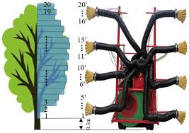
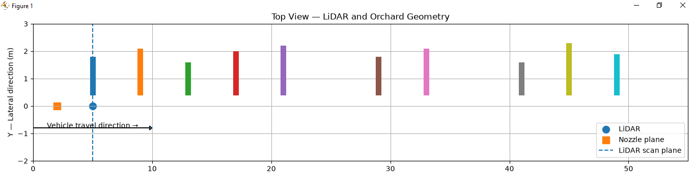
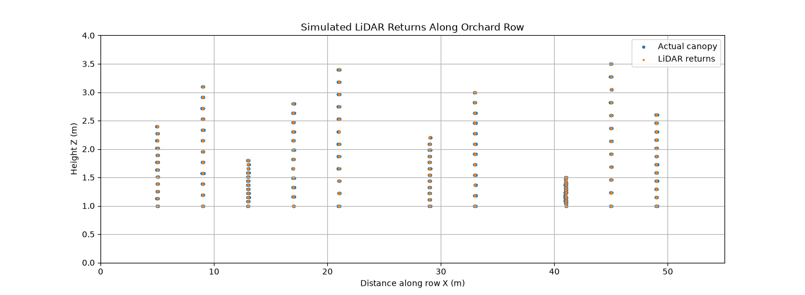

# LiDAR Adaptive Nozzle Control

A simulation of a LiDAR-based precision orchard spraying system that dynamically adjusts individual nozzle output according to detected canopy density.

The system uses a vertically mounted 2D LiDAR to sense orchard canopy structure ahead of the spray boom. Since the LiDAR is positioned 3 m ahead of the nozzle plane, detected canopy information is spatially registered using vehicle travel distance before being converted into nozzle commands.

<div align="center">



</div>

---

## Project Overview

In conventional orchard spraying, spray output is often applied uniformly even when canopy density varies significantly.

This project explores a perception-driven approach:

```text
                Orchard Canopy
                     │
                     ▼
              ┌─────────────┐
              │    LiDAR    │
              │   2D / 270° │
              └──────┬──────┘
                     │
              Vertical scan
                     │
                     ▼
          Canopy returns / density
                     │
                     ▼
          Nozzle-zone classification
                     │
                     ▼
             3 m spatial buffer
                     │
                     ▼
          Density → Flow → PWM
                     │
                     ▼
             ┌──────────────┐
             │ 6 Nozzles    │
             │ N1 ... N6    │
             └──────────────┘
```

<div align="center">



</div>

---

## System Geometry

The vehicle travels along the X axis.

```text
                 Vehicle travel direction
                         +X
                          →

      LiDAR                         Nozzle boom
        ●                                │
        │                                │
        │<-------- 3.0 m -------------->│
        │                                │
        ▼                                ▼

   Vertical LiDAR                    6 Nozzles
     scan plane                     N1 ... N6
        │                                │
        │                                │
        ▼                                ▼

     Orchard canopy / tree row
```

<div align="center">



</div>

---

## Installation

Clone the repository:

```bash
git clone https://github.com/PukyBots/lidar-based-spray-control.git
cd lidar-based-spray-control
```

Install dependencies:

```bash
pip install numpy matplotlib
```

---

## Running the Simulator

Run:

```bash
python lidar_nozzle_simulator.py
```

---

## Author

**Pulkit Garg**

Robotics Engineer | Robotics & Automation | ROS 2 | LiDAR | Computer Vision | Autonomous Systems